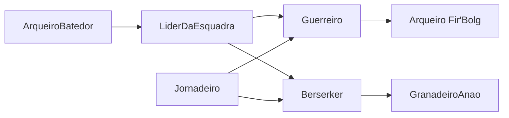

# Como escolher os 7 personagens jogadores em Myth (ano 17)

## 1. Primeiro a premissa, depois os personagens
Com 7 jogadores, o maior risco é cada um chegar com um personagem que não tem motivo para estar com os outros. Por isso a primeira decisão é sua, como mestre: **por que esses 7 estão juntos?**

Recomendo que todos façam parte da **mesma unidade da Legião**, por exemplo uma esquadra de batedores despachada de Madrigal. Isso combina com o tom de Myth, que é o diário de um soldado numa guerra perdida, e resolve de cara a hierarquia, as ordens e o motivo de viajarem juntos.

Duas alternativas, caso prefira:
- **Sobreviventes da mesma vila:** refugiados de Crow's Bridge alistados à força. O laço é emocional e a experiência de guerra é menor.
- **Grupo de escolta:** a missão é proteger um Jornadeiro ou um mensageiro até Madrigal. É um bom gancho para a primeira sessão.

## 2. Sete papéis de combate (um por jogador)
Myth é tático: cada tipo de tropa tem uma função clara. Sugiro abrir 7 vagas e deixar cada jogador escolher uma. Duas pessoas podem ficar com o mesmo tipo de tropa, mas evite três iguais.

- **Linha de frente 1:** Humano + Guerreiro. Segura a linha, escudo e espada. Custa 15 pontos.
- **Linha de frente 2:** Humano + Berserker. Ataque rápido, sem armadura, vem do Norte. Custa 15 pontos.
- **Atirador 1:** Fir'Bolg + Arqueiro. Percepção alta, flechas incendiárias, vem da floresta. Custa 20 + 10 = 30 pontos.
- **Atirador 2 / batedor:** Humano + Arqueiro. Reconhecimento, rastreio e guia do grupo. Custa 10 pontos.
- **Explosivos:** Anão + Granadeiro anão. Dano em área, mas frágil quando cercado. Custa 20 + 10 = 30 pontos.
- **Cura:** Humano + Jornadeiro. Curandeiro errante e consciência moral do grupo. Custa 5 pontos.
- **Líder da esquadra:** Humano + Guerreiro, com perícias de liderança e tática. É quem recebe as ordens, fala com os oficiais e "segura a mesa". Custa 15 pontos.

Avise os jogadores, com a campanha a 100 pontos:
- Anão e Fir'Bolg comem 20 pontos só pela raça, então esses personagens ficam mais especializados.
- Os bônus de raça e classe só entram quando a ficha é criada. Trocar de raça ou classe depois exige refazer a ficha.

## 3. Como distribuir as vagas sem briga
- Mostre as 7 vagas antes da sessão zero, com uma linha de descrição para cada.
- Cada jogador escolhe em ordem: sorteio no dado ou 1ª e 2ª opção por escrito.
- Garanta pelo menos **1 de cura e 2 de linha de frente**. O resto pode variar.

## 4. Sessão zero: perguntas para cada jogador
Cada jogador responde por escrito (as respostas podem ficar nas observações da ficha):
1. Onde você estava quando Covenant e Tyr caíram, há doze anos?
2. Quem você perdeu para o Escuro?
3. Por que entrou na Legião (ou por que foi obrigado a entrar)?
4. Do que você tem mais medo nesta guerra?
5. **Um segredo que só o mestre sabe.** Essas respostas viram os ganchos que você vai usar mais tarde.

**Laços em círculo:** cada personagem tem uma ligação com o jogador à sua esquerda (dívida, rivalidade, juramento, parentesco). Com 7 pessoas, isso fecha uma corrente e ninguém fica isolado.

## 5. Tom e mortalidade
- Combine na sessão zero que **personagens podem morrer**. Myth é triste e pesado, e a ameaça precisa ser real.
- Peça que cada jogador tenha em mente um **personagem reserva**: outro soldado da mesma unidade, que entra direto sem quebrar a premissa.

## 6. Cuidados com spoilers
- Os jogadores só sabem o que um soldado do ano 17 saberia, ou seja, o texto público dos locais e NPCs no site.
- Nenhum passado de personagem deve depender de segredos dos Senhores Caídos nem do que você guardou nas notas de mestre. Se um jogador pedir algo nessa linha, transforme em boato ou lenda que ele "ouviu falar".

## 7. Dicas para uma mesa de 7
- Use o líder da esquadra para decisões rápidas do grupo: a mesa discute, ele decide.
- Dê momentos de destaque em rodízio: em cada sessão, foque em um ou dois personagens com cenas ligadas ao segredo deles.
- Em combate, pense como em Myth: posição, terreno e linha de frente valem mais que ações individuais.

## O que eu faço depois que você aprovar
- Escrever o texto público da premissa escolhida (sem spoilers) e colocar na descrição da campanha Myth no site. Os jogadores leem isso ao entrar.
- Montar a folha da sessão zero (as 7 vagas + as 5 perguntas + os laços) como texto pronto para você mandar aos jogadores.
